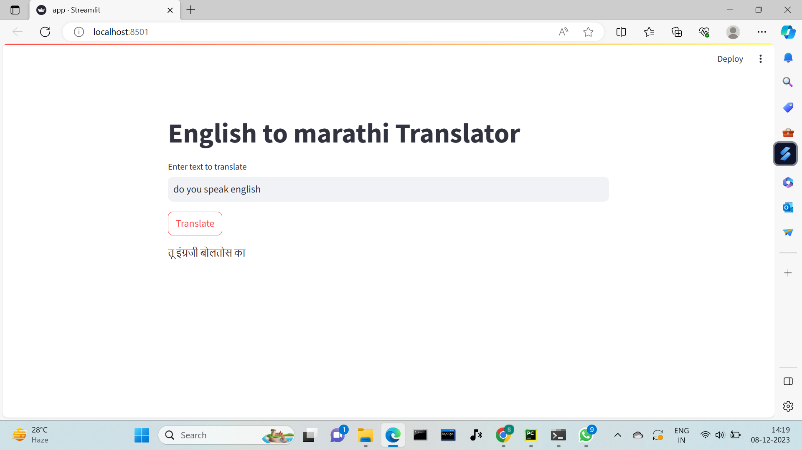
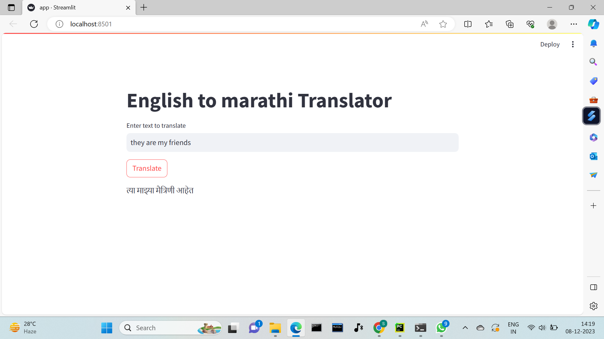
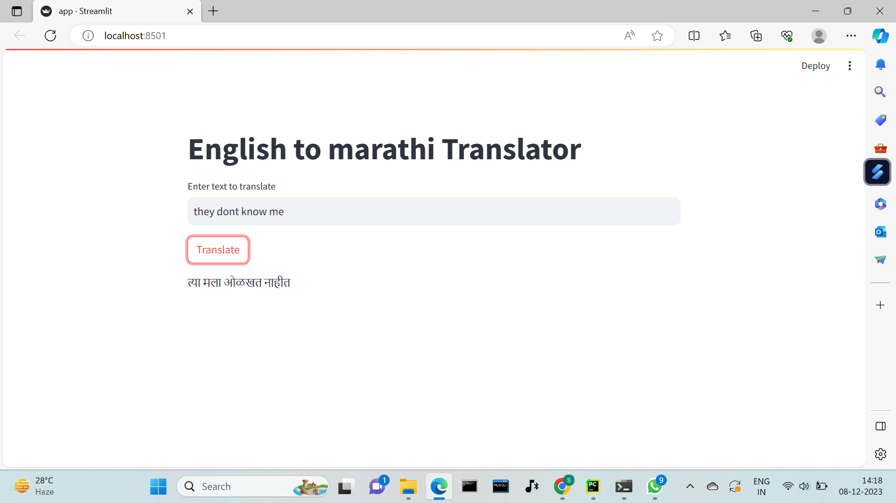

# *Neural Machine Translation* implemented in Tensorflow

This is a Tensorflow implementation of *[Attention-based Neural Machine Translation](https://arxiv.org/pdf/1409.0473.pdf)*.
It uses tab-delimited bilingual sentence pairs to train predictive language models.
 
### Implementation Architecture

**The Bahdanau Architecture**
>* The Encoder
>* The Decoder
>* The Bahdanau Attention Algorithm

## streamlit UI
Ran locally using streamlit UI
 
 

 

 

 
## Results

<table style="width:100%;text-align:left"> 
    <th>Input Sequence (English)</th>
    <th>Output Sequence (Marathi)</th>
    <tr style="font-style:italic">
        <td>i like french </td>
        <td>मला फ्रेंच आवडते</td>
    </tr>
    <tr style="font-style:italic">
        <td>your cell phones not working</td>
        <td>तुमचा सेलफोन चालत नाहीये</td>
    </tr>
    <tr style="font-style:italic">
        <td>whats your favorite website </td>
        <td>तुमचं आवडतं संकेतस्थळ कोणतं आहे</td>
    </tr>
    <tr style="font-style:italic">
        <td>spanish is widely spoken in south america </td>
        <td>दक्षिण अमेरिकेत अमेरिकेत बोलली जाते</td>
    </tr>
    <tr style="font-style:italic">
        <td> if hed known the truth hed have told me </td>
        <td>त्याला सत्य माहीत असतं तर त्याने मला सांगितलं असतं</td>
    </tr>
</table>

